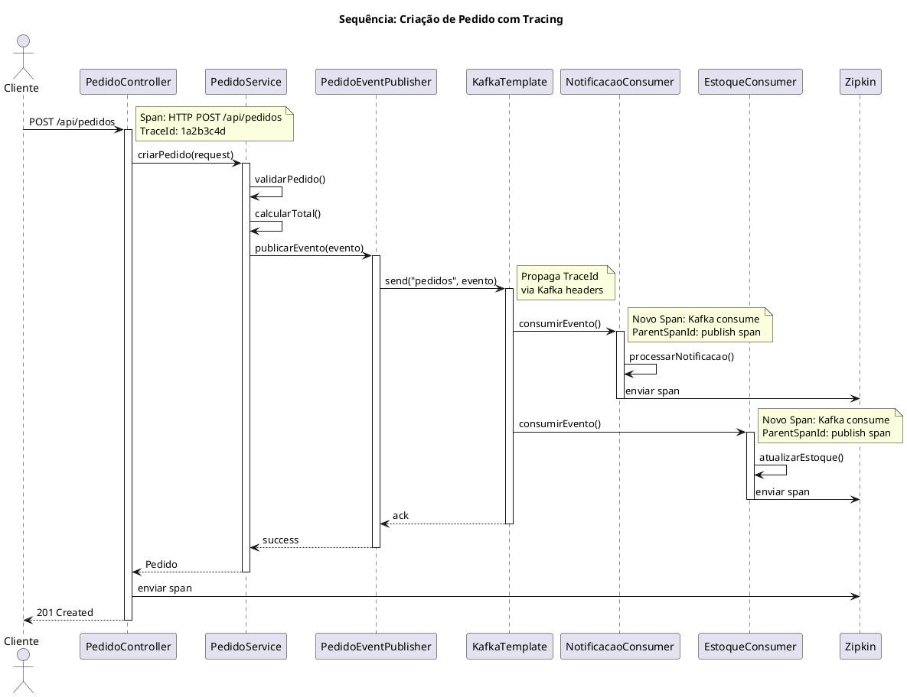
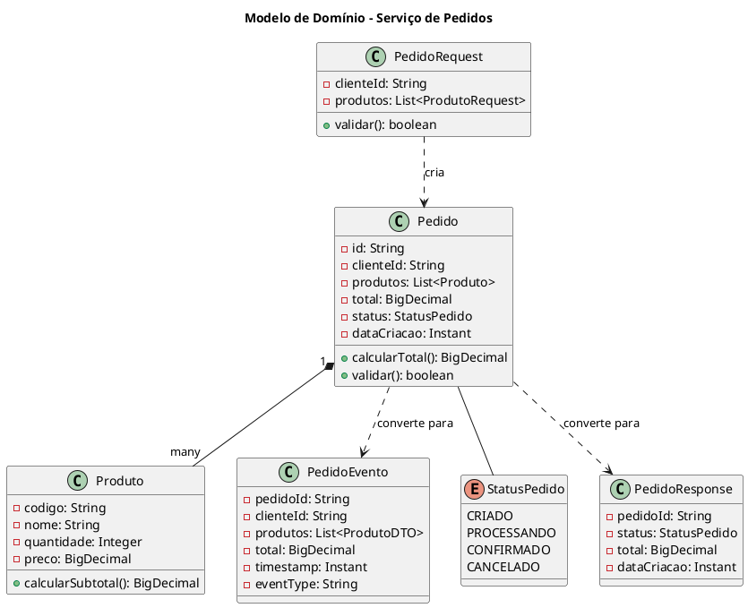
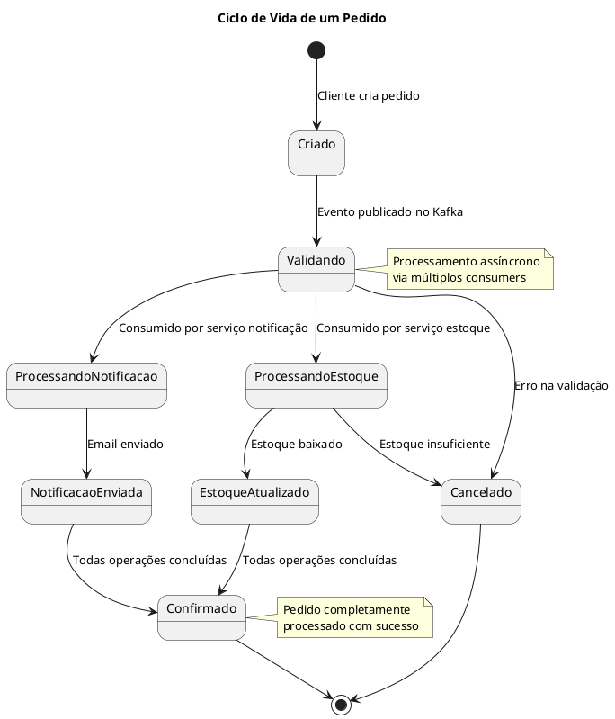
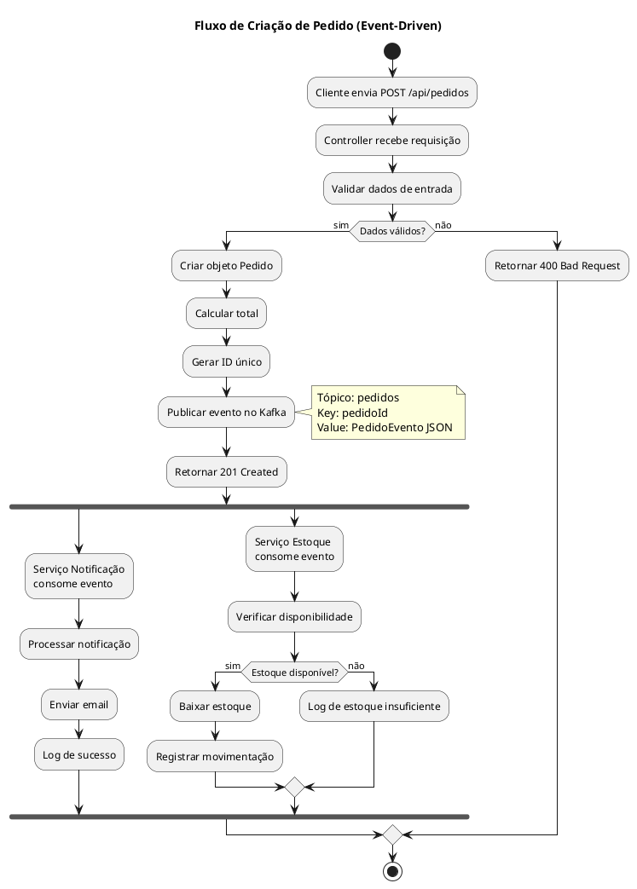
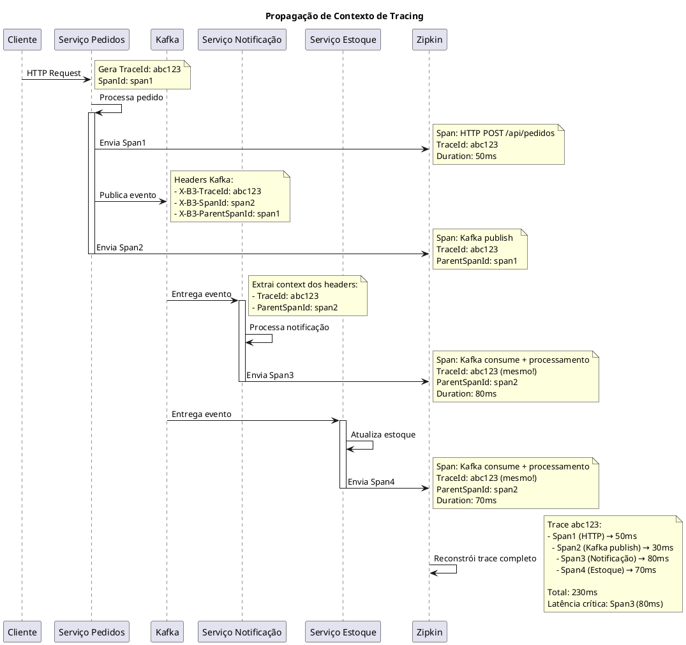
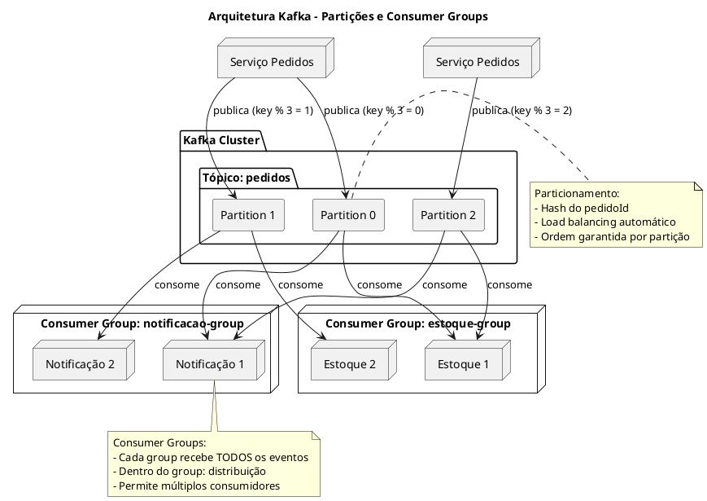

# Diagramas PlantUML - Sistema de Processamento de Pedidos

## Sobre este Documento

Este documento contém diagramas em formato PlantUML que complementam a documentação C4 Model. Os diagramas podem ser renderizados em ferramentas que suportam PlantUML ou em editores online como [PlantUML Editor](https://www.plantuml.com/plantuml/uml/).

---

## 1. Diagrama de Contexto do Sistema (C4 - Nível 1)

```plantuml
@startuml
!include https://raw.githubusercontent.com/plantuml-stdlib/C4-PlantUML/master/C4_Context.puml

LAYOUT_WITH_LEGEND()

title Diagrama de Contexto - Sistema de Processamento de Pedidos

Person(cliente, "Cliente", "Usuário que realiza pedidos")

System(sistema, "Sistema de Processamento de Pedidos", "Gerencia pedidos, notificações e estoque usando Event-Driven Architecture")

System_Ext(email, "Sistema de E-mail", "Envia notificações por email")

Rel(cliente, sistema, "Cria pedidos via", "HTTP/REST")
Rel(sistema, email, "Envia notificações", "SMTP (simulado)")

@enduml
```

---

## 2. Diagrama de Containers (C4 - Nível 2)

```plantuml
@startuml
!include https://raw.githubusercontent.com/plantuml-stdlib/C4-PlantUML/master/C4_Container.puml

LAYOUT_WITH_LEGEND()

title Diagrama de Containers - Sistema de Processamento de Pedidos

Person(cliente, "Cliente", "Usuário que realiza pedidos")

System_Boundary(c1, "Sistema de Processamento de Pedidos") {
    Container(api, "Serviço de Pedidos", "Spring Boot", "Recebe pedidos e publica eventos")
    Container(notif, "Serviço de Notificação", "Spring Boot", "Processa notificações de pedidos")
    Container(estoque, "Serviço de Estoque", "Spring Boot", "Gerencia estoque de produtos")
    ContainerQueue(kafka, "Apache Kafka", "Message Broker", "Gerencia eventos do sistema")
    Container(zipkin, "Zipkin", "Distributed Tracing", "Coleta e visualiza traces")
}

ContainerDb(zookeeper, "Zookeeper", "Coordination Service", "Coordena cluster Kafka")

Rel(cliente, api, "Cria pedidos", "HTTP/REST (JSON)")
Rel(api, kafka, "Publica eventos", "Kafka Protocol")
Rel(kafka, notif, "Consome eventos", "Kafka Consumer")
Rel(kafka, estoque, "Consome eventos", "Kafka Consumer")
Rel(api, zipkin, "Envia traces", "HTTP")
Rel(notif, zipkin, "Envia traces", "HTTP")
Rel(estoque, zipkin, "Envia traces", "HTTP")
Rel(kafka, zookeeper, "Coordenação", "Zookeeper Protocol")

@enduml
```

---

## 3. Diagrama de Componentes - Serviço de Pedidos (C4 - Nível 3)

```plantuml
@startuml
!include https://raw.githubusercontent.com/plantuml-stdlib/C4-PlantUML/master/C4_Component.puml

LAYOUT_WITH_LEGEND()

title Diagrama de Componentes - Serviço de Pedidos

Container_Boundary(api, "Serviço de Pedidos") {
    Component(controller, "PedidoController", "Spring MVC Controller", "Expõe API REST para criação de pedidos")
    Component(service, "PedidoService", "Spring Service", "Lógica de negócio de pedidos")
    Component(publisher, "PedidoEventPublisher", "Spring Component", "Publica eventos no Kafka")
    Component(model, "Pedido/PedidoEvento", "Domain Model", "Modelos de domínio")
    Component(config, "KafkaConfig", "Spring Configuration", "Configuração do Kafka Producer")
}

ContainerQueue_Ext(kafka, "Apache Kafka", "Tópico: pedidos")
Container_Ext(zipkin, "Zipkin", "Distributed Tracing")

Rel(controller, service, "Usa", "Java")
Rel(service, publisher, "Usa", "Java")
Rel(service, model, "Usa", "Java")
Rel(publisher, kafka, "Publica eventos", "KafkaTemplate")
Rel(config, publisher, "Configura", "Spring")
Rel(controller, zipkin, "Envia traces", "Micrometer")

@enduml
```

---

## 4. Diagrama de Sequência - Criação de Pedido



---

## 5. Diagrama de Deployment - Docker Compose

```plantuml
@startuml
!include https://raw.githubusercontent.com/plantuml-stdlib/C4-PlantUML/master/C4_Deployment.puml

title Diagrama de Deployment - Ambiente Docker

Deployment_Node(docker, "Docker Host", "Docker Engine") {
    Deployment_Node(network, "arquitetura-network", "Docker Network") {
        
        Deployment_Node(zk_container, "Container: zookeeper", "Docker Container") {
            Container(zookeeper, "Zookeeper", "CP Zookeeper 7.5", "Porta 2181")
        }
        
        Deployment_Node(kafka_container, "Container: kafka", "Docker Container") {
            Container(kafka, "Apache Kafka", "CP Kafka 7.5", "Portas 9092, 9093")
        }
        
        Deployment_Node(zipkin_container, "Container: zipkin", "Docker Container") {
            Container(zipkin, "Zipkin", "OpenZipkin 2.24", "Porta 9411")
        }
        
        Deployment_Node(ui_container, "Container: kafka-ui", "Docker Container") {
            Container(ui, "Kafka UI", "Provectus", "Porta 8090")
        }
    }
    
    Deployment_Node(app1, "Host Machine", "Java 17") {
        Container(pedidos, "Serviço Pedidos", "Spring Boot", "Porta 8080")
    }
    
    Deployment_Node(app2, "Host Machine", "Java 17") {
        Container(notif, "Serviço Notificação", "Spring Boot", "Porta 8081")
    }
    
    Deployment_Node(app3, "Host Machine", "Java 17") {
        Container(estoque, "Serviço Estoque", "Spring Boot", "Porta 8082")
    }
}

Rel(kafka, zookeeper, "Coordena com", "Zookeeper Protocol")
Rel(pedidos, kafka, "Publica em", "Kafka Producer")
Rel(notif, kafka, "Consome de", "Kafka Consumer")
Rel(estoque, kafka, "Consome de", "Kafka Consumer")
Rel(pedidos, zipkin, "Traces", "HTTP")
Rel(notif, zipkin, "Traces", "HTTP")
Rel(estoque, zipkin, "Traces", "HTTP")
Rel(ui, kafka, "Monitora", "Kafka API")

@enduml
```

---

## 6. Diagrama de Deployment - Sidecar Pattern

```plantuml
@startuml
!include https://raw.githubusercontent.com/plantuml-stdlib/C4-PlantUML/master/C4_Deployment.puml

title Diagrama de Deployment - Sidecar Pattern com OpenTelemetry

Deployment_Node(pod, "Kubernetes Pod", "Container Group") {
    Deployment_Node(app_container, "Application Container", "Docker") {
        Container(app, "Serviço de Pedidos", "Spring Boot", "Código de negócio puro")
    }
    
    Deployment_Node(sidecar, "Sidecar (Java Agent)", "JVM Agent") {
        Container(otel, "OpenTelemetry Agent", "Java Agent", "Auto-instrumentação")
    }
}

Deployment_Node(infra, "Infrastructure") {
    Container(zipkin, "Zipkin", "Tracing Backend", "Coleta traces")
    Container(kafka, "Kafka", "Event Broker", "Gerencia eventos")
}

Rel(app, otel, "Instrumentado por", "Bytecode injection")
Rel(otel, zipkin, "Envia spans", "HTTP/OTLP")
Rel(app, kafka, "Publica/Consome", "Kafka Protocol")
Rel(otel, kafka, "Intercepta e instrumenta", "Auto-instrumentation")

note right of otel
  Responsabilidades:
  - Criar spans automaticamente
  - Propagar contexto
  - Coletar métricas
  - Enviar para backend
end note

note right of app
  Código limpo:
  - Sem imports de tracing
  - Sem dependências
  - Foco em negócio
end note

@enduml
```

---

## 7. Diagrama de Classes - Domain Model



---

## 8. Diagrama de Estados - Ciclo de Vida do Pedido



---

## 9. Diagrama de Atividades - Fluxo de Criação de Pedido



---

## 10. Diagrama de Comunicação - Distributed Tracing



---

## 11. Diagrama de Infraestrutura - Kafka Partitioning



---

## 12. Diagrama de Comparação - Com e Sem Sidecar

```plantuml
@startuml
title Comparação: Instrumentação Manual vs Sidecar Pattern

package "Abordagem Manual (Micrometer)" {
    component "Serviço de Pedidos" as SM {
        [Código de Negócio] as BM
        [Código de Tracing] as TM
        [Dependências Maven] as DM
        
        BM -down-> TM : acoplado
        TM -down-> DM : requer
    }
    
    note right of SM
        ❌ Código misturado
        ❌ Dependências acopladas
        ❌ Rebuild para atualizar
        ❌ Manutenção complexa
    end note
}

package "Abordagem Sidecar (OpenTelemetry)" {
    component "Serviço de Pedidos" as SS {
        [Código de Negócio] as BS
    }
    
    component "OpenTelemetry Agent" as OA {
        [Auto-instrumentação] as AI
        [Context Propagation] as CP
        [Exporters] as EX
    }
    
    [Configuração Externa] as CE
    
    BS -down-[hidden]- OA
    OA -up-> BS : instrumenta (bytecode)
    CE -right-> OA : configura
    
    note right of SS
        ✅ Código limpo
        ✅ Zero dependências
        ✅ Atualização independente
        ✅ Configuração externa
    end note
}

cloud "Zipkin" as Z

SM --> Z : envia traces
OA --> Z : envia traces

@enduml
```

---

## Como Usar Estes Diagramas

### Opção 1: PlantUML Online

1. Acesse https://www.plantuml.com/plantuml/uml/
2. Cole o código do diagrama
3. Visualize e exporte (PNG, SVG, PDF)

### Opção 2: VS Code

1. Instale a extensão "PlantUML"
2. Abra este arquivo
3. Use `Alt+D` para preview

### Opção 3: IntelliJ IDEA

1. Instale o plugin "PlantUML Integration"
2. Clique direito no bloco de código
3. Selecione "Show PlantUML Diagram"

### Opção 4: CLI

```bash
# Instalar PlantUML
brew install plantuml  # macOS
apt install plantuml   # Linux

# Gerar imagens
plantuml -tpng diagrams.puml
plantuml -tsvg diagrams.puml
```

---

## Legenda de Cores (C4 Model)

- **Azul**: Pessoas (Actors)
- **Verde**: Sistemas internos
- **Cinza**: Sistemas externos
- **Azul claro**: Containers
- **Amarelo**: Componentes
- **Roxo**: Databases/Queues

---

## Referências

- [PlantUML Documentation](https://plantuml.com/)
- [C4-PlantUML](https://github.com/plantuml-stdlib/C4-PlantUML)
- [PlantUML Cheat Sheet](https://plantuml.com/guide)

---

**Última Atualização**: 2024-01-18
**Versão**: 1.0
